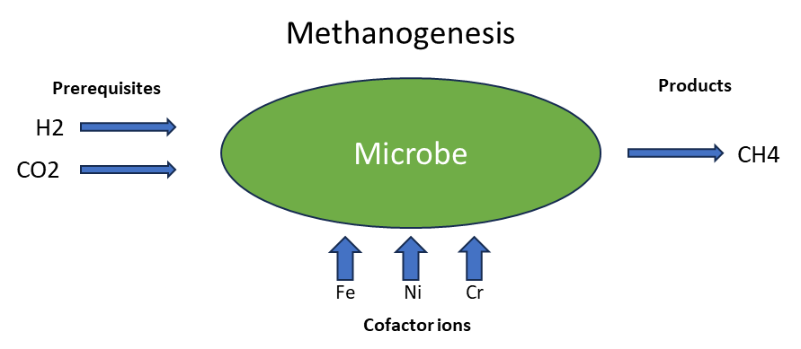
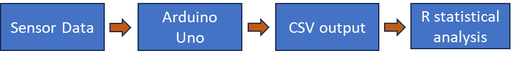

# ChemNose:An Automated Gas Detection and Statistical Analysis Platform

## Table of Contents
- [Overview](#overview)

## Overview
ChemNose is an arduino based gas detection and chemical reaction observation platform. It is designed to be a low cost, portable, and easy to use platform for detecting gases and observing chemical reactions. The platform is built around an Arduino Uno and uses a variety of sensors to detect gases and observe chemical reactions. The platform is designed to be modular and expandable, allowing users to add additional sensors and modules as needed.
It was primarily designed for and used in simulated Mars and Moon exploration science missions for the Anatolian Rover Challenge 2024 by Uludağ University Rover Team (ULUROVER).
Their science team, under my leadership had a hypothesis investigating the habitability of Mars and Moon for Methanogenic Microorganisms. With this in mind, I designed the platform and data analysis pipeline to fit this task.

## Materials And Methods

The platform was built to mainly investigate the habitability of Mars for Methanogenic Microorganisms alongside other chemical assays that are beyond the scope of this document. The main simplified assumption of how a methanogenic microorganisms produce methane is outlined in the diagram below:

The presence of and changes in the concentrations in ppm of the gases CO2, CH4 and H2 were measured using the MQ-135, MQ-4 and MQ-8 gas sensors respectively. The test for the presence of the other ions necessary for cofactors was done using ion specific chemicals assays.  

The general form of the platform 's pipeline is shown in the diagram below:

The platform consists of 4 modules:
- The Weather Station Module
- The Gas Detection Module with no SD card functionality
- The Gas Detection Module with SD card functionality
- The Soil Moisture Module

### The Weather Station Module

This is the main module that was designed to be run independent of a direct computer connection of the arduino uno. It's main purpose is to measure the temperature, humidity, CH4, CO2 and H2 concentration in the air during the Rover's missions. The data is stored in a SD card for later analysis as a timestamped CSV file in the %m/%d/%Y %H:%M:%S format. Readings are taken every 2 seconds to reduce error of the sensosrs for the out put of a high quality dataset. 
The circuit diagram for the weather station module is shown below:

It consists fo the following sensors:
- DHT11 Temperature and Humidity Sensor
- MQ-135 Gas Sensor
- MQ-4 Gas Sensor
- MQ-8 Gas Sensor
- DS3231 RTC Module
- SD Card Module

#### The Weather Station Module Carrying Case

A 3D printable carrying case for the module was designed for easy mounting on the rover. It is a modular 3 piece design that can be easily assembled and disassembled. The design files for the carrying case can be found in the `3D Models` folder.
The overall schemetics for the carrying case is shown below:

Placement of the circuit components in the case is shown below:

_(note, batteries are to be placed in two 4 AA battery holders that go into the bottom section of the case not side by side as the diagram depicts)_

The sensors will sit int the designated slots in the top of the case similar to the image shown below:

## Future Directions For the Project
- Add a VEML6070 UV Sensor to the Weather Station to measure UV Index.
- Add a BME280 Sensor to the Weather Station for more accurate temperature and humidity readings as well as barometric pressure readings.
- Automate the data analysis process with a bash script.
- Add a pipeline explanatory diagram to the README.md file.
- Add a section to the README.md file that explains how to use the platform.
- Add a CSV reading function to the arduino sketch to transfer data to the computer.
- Add SENose: An under U$50 electronic nose for the monitoring of soil gas emissions as the inspiration 
- also add the fact that it is designed for efficient significance testing with small datasets
- add the whole change load resistance in the main file or whatever
-  Maybe go over the limitations of the project
- why willow signed rank test
- Maybe change the weather station to also sample every 2 seconds if it doesn't already
- give MERT his design creds
- add the fact that the boxes need to have the soil in them 3 mins before taking readings
- add the fact that the soil moisture sensor needs to have the soil poured over it in a petri dish. Maybe make a diagram
- TimeTempSD Connections
DHT11 connections - D2

RTC connections:
RST- D8
DAT - D6
CLK- D7
RTC uses 3.3V
SD connections:
CS- D4
SCK- D13
MOSI- D11
MISO- D12

- collect and cut empty plastic bottle bottoms to make petri dishes for the cas chambers
- add the fact that the gas sensors need to be warmed up for 24 hours before use