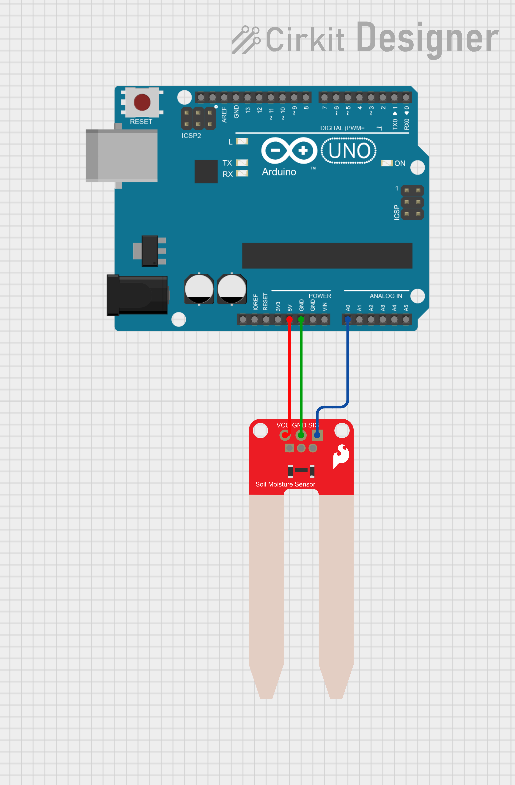
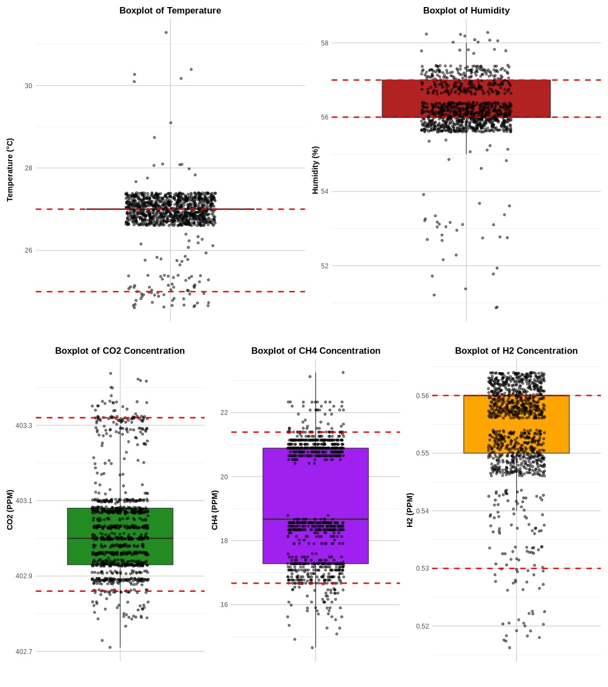
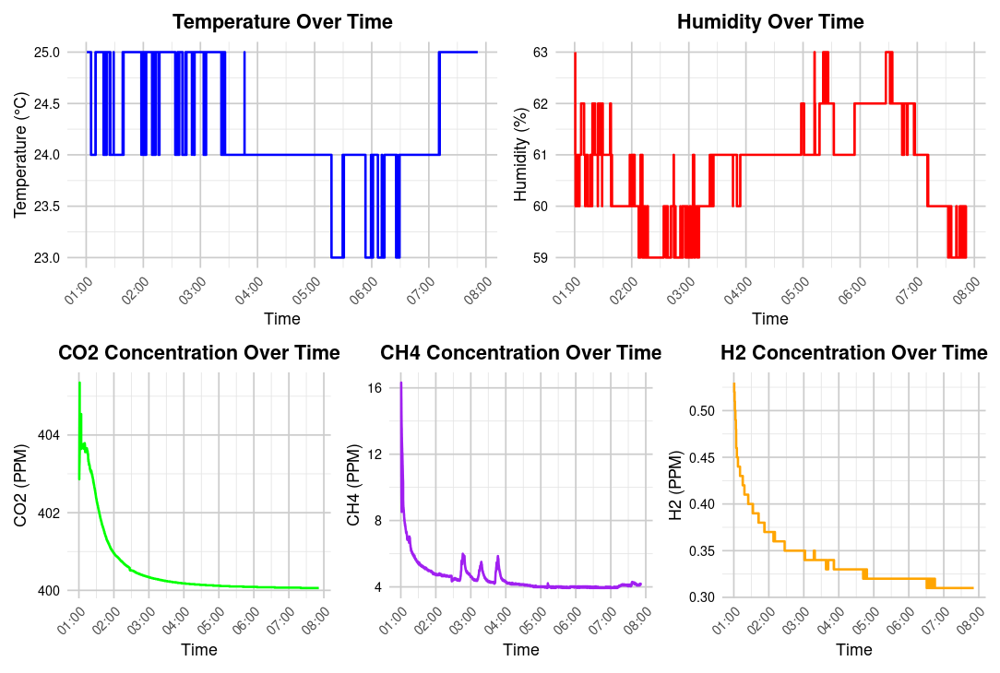
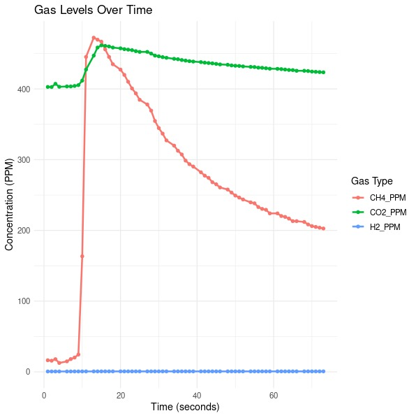
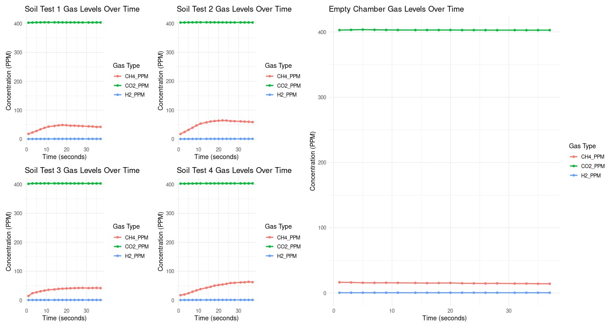
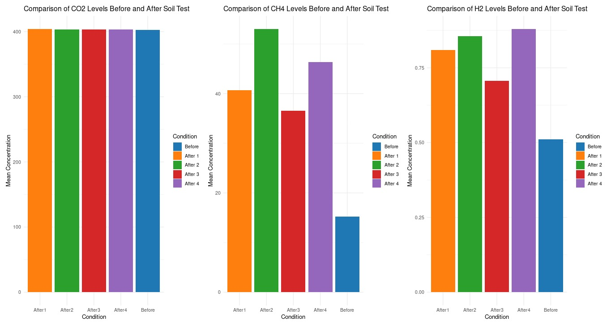

# ChemNose:An Automated Gas Detection and Statistical Analysis Platform

<div style="text-align: center;">
    
</div>

## Table of Contents
- [Overview](#overview)
- [Materials And Methods](#materials-and-methods)
  - [The Weather Station Module](#the-weather-station-module)
    - [The Weather Station Module Carrying Case](#the-weather-station-module-carrying-case)
  - [The Gas Measurement Chamber For The Gas Detection Modules](#the-gas-measurement-chamber-for-the-gas-detection-modules)
  - [The Soil Moisture Module](#the-soil-moisture-module)
- [Data Analysis Pipeline](#data-analysis-pipeline)
  - [Weather Station Data Analysis](#weather-station-data-analysis)
  - [Gas Detection Data Analysis](#gas-detection-data-analysis)
  - [Soil Moisture Data Analysis](#soil-moisture-data-analysis)
- [Future Directions For the Project](#future-directions-for-the-project)

## Overview
ChemNose is an arduino based gas detection and chemical reaction observation platform. It is designed to be a low cost, portable, and easy to use platform for detecting gases and observing chemical reactions. The platform is built around an Arduino Uno and uses a variety of sensors to detect gases and observe chemical reactions. The platform is designed to be modular and expandable, allowing users to add additional sensors and modules as needed.

It was primarily designed for and used in simulated Mars and Moon exploration science missions for the Anatolian Rover Challenge 2024 by Uludağ University Rover Team (ULUROVER).
Their science team, under my leadership had a hypothesis investigating the habitability of Mars and Moon for Methanogenic Microorganisms. With this in mind, I designed the platform and data analysis pipeline to fit this task.

## Materials And Methods

The platform was built to mainly investigate the habitability of Mars for Methanogenic Microorganisms alongside other chemical assays that are beyond the scope of this document. The main simplified assumption of how a methanogenic microorganisms produce methane is outlined in the diagram below:


The presence of and changes in the concentrations in ppm of the gases CO2, CH4 and H2 were measured using the MQ-135, MQ-4 and MQ-8 gas sensors respectively. The test for the presence of the other ions necessary for cofactors was done using ion specific chemicals assays.  

The general form of the platform 's pipeline is shown in the diagram below:


The platform consists of 4 modules:
- The Weather Station Module
- The Gas Detection Module with no SD card functionality
- The Gas Detection Module with SD card functionality
- The Soil Moisture Module

### The Weather Station Module

This is the main module that was designed to be run independent of a direct computer connection of the arduino uno. It's main purpose is to measure the temperature, humidity, CH4, CO2 and H2 concentration in the air during the Rover's missions. The data is stored in a SD card for later analysis as a timestamped CSV file in the %m/%d/%Y %H:%M:%S format. Readings are taken every 2 seconds to reduce error of the sensors for the output of a high quality dataset. 
The circuit diagram for the weather station module is shown below:


It consists fo the following sensors:
- DHT11 Temperature and Humidity Sensor
- MQ-135 Gas Sensor
- MQ-4 Gas Sensor
- MQ-8 Gas Sensor
- DS3231 RTC Module
- SD Card Module

**The components are configured as follows:**

DHT11 connections:
- D2

RTC connections:
- RST- D8
- DAT - D6
- CLK- D7
- **Note** RTC uses 3.3V not 5V

SD connections:
- CS- D4
- SCK- D13
- MOSI- D11
- MISO- D12

MQ-135: A0
MQ-4: A3
MQ-8: A1

#### The Weather Station Module Carrying Case

A 3D printable carrying case for the module was designed for easy mounting on the rover. It is a modular 3 piece design that can be easily assembled and disassembled. The design files for the carrying case can be found in the [`Weatherbox 3D Printable`](Weatherbox 3D Printable) folder.The overall schematics for the carrying case is shown below:


Placement of the circuit components in the case is shown below:


_(note, batteries are to be placed in two 4 AA battery holders that go into the bottom section of the case not side by side as the diagram depicts)_

The sensors will sit int the designated slots in the top of the case similar to the image shown below:


### The Gas Measurement Chamber For The Gas Detection Modules

The Circuit Diagram for the Gas Detection Modules are shown below:

<div style="display: flex; align-items: flex-start;">
    <div style="margin-right: 20px;">
        
        <p style="text-align: left;"><em>(without SD card functionality)</em></p>
    </div>
    <div>
        
        <p style="text-align: left;"><em>(with SD card functionality)</em></p>
    </div>
</div>

It consists fo the following sensors:
- DHT11 Temperature and Humidity Sensor
- MQ-135 Gas Sensor
- MQ-4 Gas Sensor
- MQ-8 Gas Sensor
- SD Card Module(Optional)

**The components are configured as follows:**
SD connections:
- CS- D4
- SCK- D13
- MOSI- D11
- MISO- D12

MQ-135: A0
MQ-4: A3
MQ-8: A1

A novel 350ml closed gas chamber was designed and made using an airtight plastic container with holes to tightly fit the gas sensors. This allows for greater accuracy of the gs measurements. The chamber is setup is shown below:

<div style="display: flex; justify-content: space-around; align-items: center;">
    <div>
        
        <p style="text-align: center;"><em>Sensor Box Lid</em></p>
    </div>
    <div>
        
        <p style="text-align: center;"><em>Closed Box Top View</em></p>
    </div>
    <div>
        
        <p style="text-align: center;"><em>Box in Laboratory Setting</em></p>
    </div>
    <div>
        
        <p style="text-align: center;"><em>Open Box in Laboratory</em></p>
    </div>
</div>

### The Soil Moisture Module

For measurement and classification of soil sample humidity in the lab setting, another module was designed using an arduino uno and a soil moisture sensor. **_This setup requires no specialized housing and does not return a CSV output for analysis_**. The circuit diagram for the soil moisture module is shown below: 



## Data Analysis Pipeline

### Weather Station Data Analysis

**Step 1: Data Collection**  
Set up the Weather Station Module and run the [Arduino_code/weatherStationNoUv/weatherStationNoUv.ino](Arduino_code/weatherStationNoUv/weatherStationNoUv.ino) Arduino sketch on the Arduino Uno. The data will be stored in a CSV file on the SD card in a name of your choosing.

**Step 2: Data Analysis**  
Retrieve the CSV file from the SD card and move it into the repository folder called [Sensor_data](Sensor_data). The data titled `DAY1.csv` and `DAY2.csv` is an example of the data that will be collected.  
Boxplot alongside textual summary statistics and Line plots of the metrics can be obtained by using the [R_code/day2Boxes.R](R_code/day2Boxes.R) and [R_code/day2Lines.R](R_code/day2Lines.R) scripts.

They generate plots like the ones shown below:



_Box Plot Example_



_Day Line Plot Example_

### Gas Detection Data Analysis
The data analysis for gas can be done one of two ways; A mode purely for observation of gas levels in a soil sample or given reaction in the gas chamber and the second being a mode where data from multiple soil samples is compared together. 

Step 1: Data Collection
Set up the Gas Detection Module and run the [Arduino_code/MQsWSDCard/MQsWSDCard.ino](Arduino_code/MQsWSDCard/MQsWSDCard.ino) Arduino sketch on the Arduino Uno. The data will be stored in a CSV file on the SD card in a name of your choosing, or alternatively you can copy and paste the CSV output from the serial monitor and into a new CSV file.

Step 2: Data Analysis
- To simply observe the changes in gas levels in a soil sample or given reaction over time, you can use the [R_code/peroxideTestLine.R](R_code/peroxideTestLine.R) script. This script generates a line plot of the gas levels over time. To test the script, you can use the soilGasSample data or the Peroxide Reaction data in the [Sensor_data](Sensor_data) folder. This produces a plot like the one shown below:



_Gas Change Over Time Line Plot. When Observing reactions sharper peaks indicate more vigorous reactions_

- To compare the changes in gas levels in multiple soil samples as well as an empty chamber, you can use the [R_code/barAllSoilComparison.R](R_code/barAllSoilComparison.R) and the [R_code/lineAllSoilComparison.R](R_code/lineAllSoilComparison.R) script. These scripts generate a patched graphic of line plots of gas change over time and bar plots of mean changes per gas side by side respectively. To test the script, you can use the soilGasSample data in the [Sensor_data](Sensor_data) folder. This produces plots like the ones shown below:



_Multiple Sample Gas Change Over Time Comparison Line Plot_



_Multiple Sample Means Comparison Bar Plot_

- The [R_code/WilcoxonSigned-RankTest.R](R_code/WilcoxonSigned-RankTest.R) script can be used to perform a Wilcoxon Signed Rank Test on the data to determine if there is a significant difference in the gas levels between the soil samples and an empty gas chamber such that a conclusion can be made that the soil is the source of the gas. This script generates a textual output of the test results. To test the script, you can use the soilGasSample data in the [Sensor_data](Sensor_data) folder. The test follows the hypotheses:

```
(H₀): μ CH4 before = μ CH4 after |  (H₀): μ CO2 before = μ CO2 after | (H₀): μ H2 before = μ H2 after

(H₁): μ CH4 before < μ CH4 after | (H₁): μ CO2 before < μ CO2 after | (H₁): μ H2 before > μ H2 after
```

### Soil Moisture Data Analysis
This is quite straightforward and the data can be read an interpreted all by using the serial monitor output. 

## Additional Notes
- Make sure to set the load resistance value in Arduino/libraries/MQUnifiedsensor/MQUnifiedsensor.h to the correct value for the MQ sensors you are using. The default value is 10kΩ, the value on most modules is 1kΩ.
- The Project was largely inspired by Pineda, D. M., & Pérez, J. C. (2017). SENose: An under U$50 electronic nose for the monitoring of soil gas emissions. Computers and Electronics in Agriculture, 133, 15-21. https://doi.org/10.1016/j.compag.2016.12.004
- The Project was designed for efficient significance testing with small datasets.
- The Project is largely limited to use in a theoretical setting where sensors with a high margin of error are used. The data analysis pipeline is also not designed to fully account for this with appropriate normalization and scaling techniques.
- 
## Future Directions For the Project
- Add a VEML6070 UV Sensor to the Weather Station to measure UV Index.
- Add a BME280 Sensor to the Weather Station for more accurate temperature and humidity readings as well as barometric pressure readings.
- Automate the data analysis process with a bash script.
- Add a CSV reading function to the arduino sketch to transfer data to the computer.
